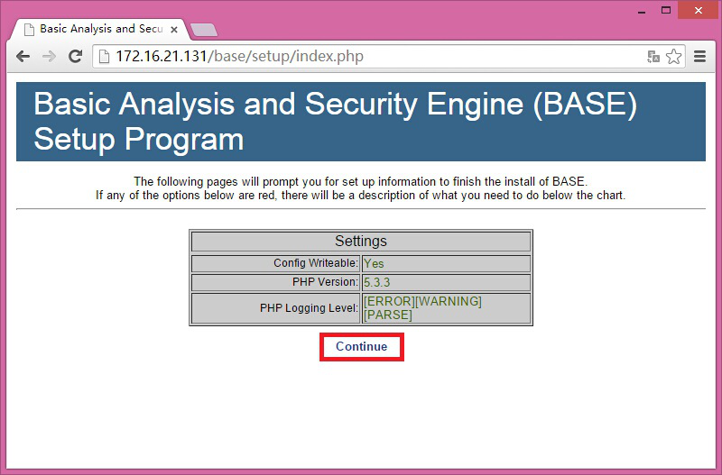
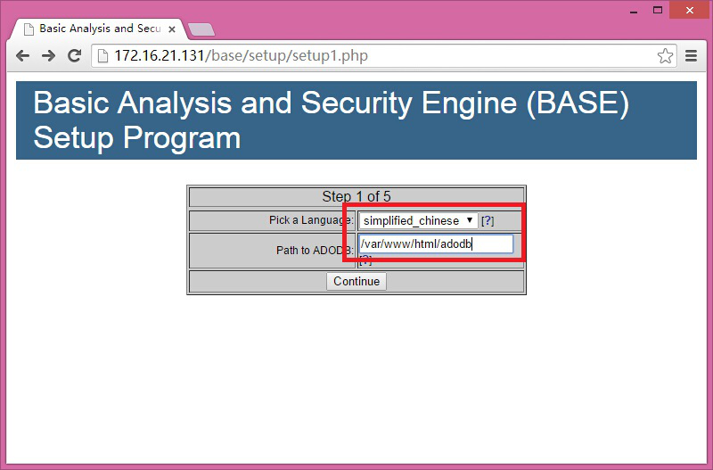
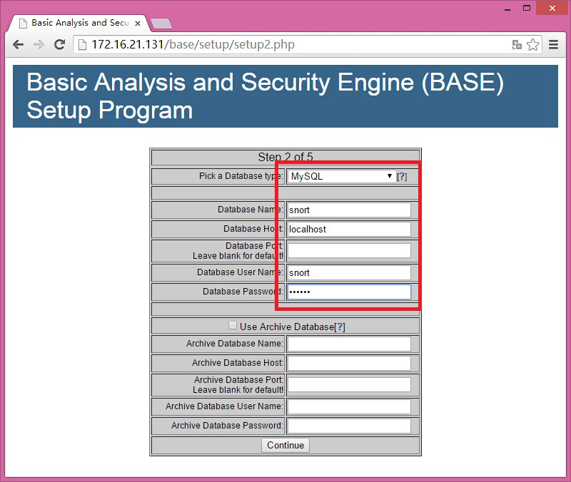
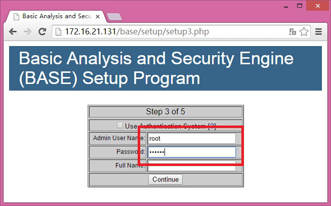
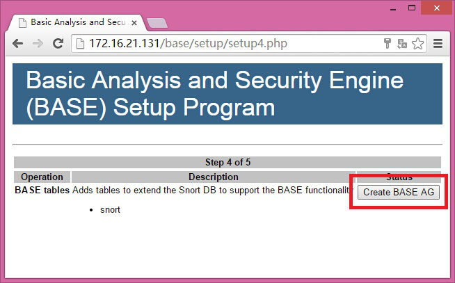
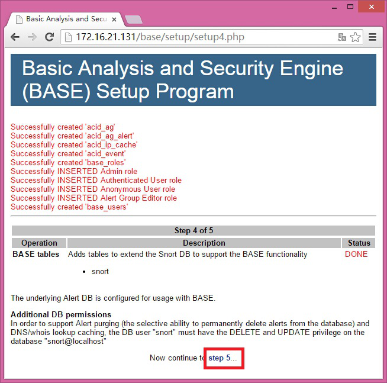
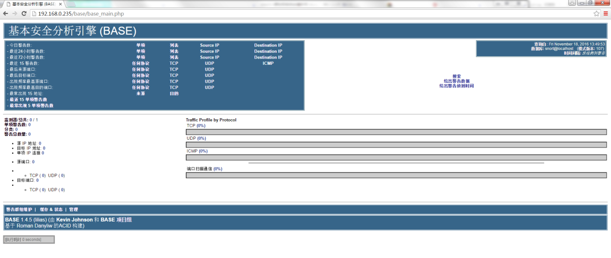
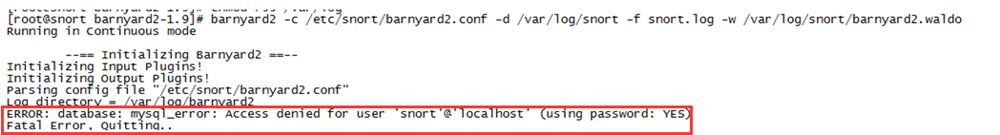
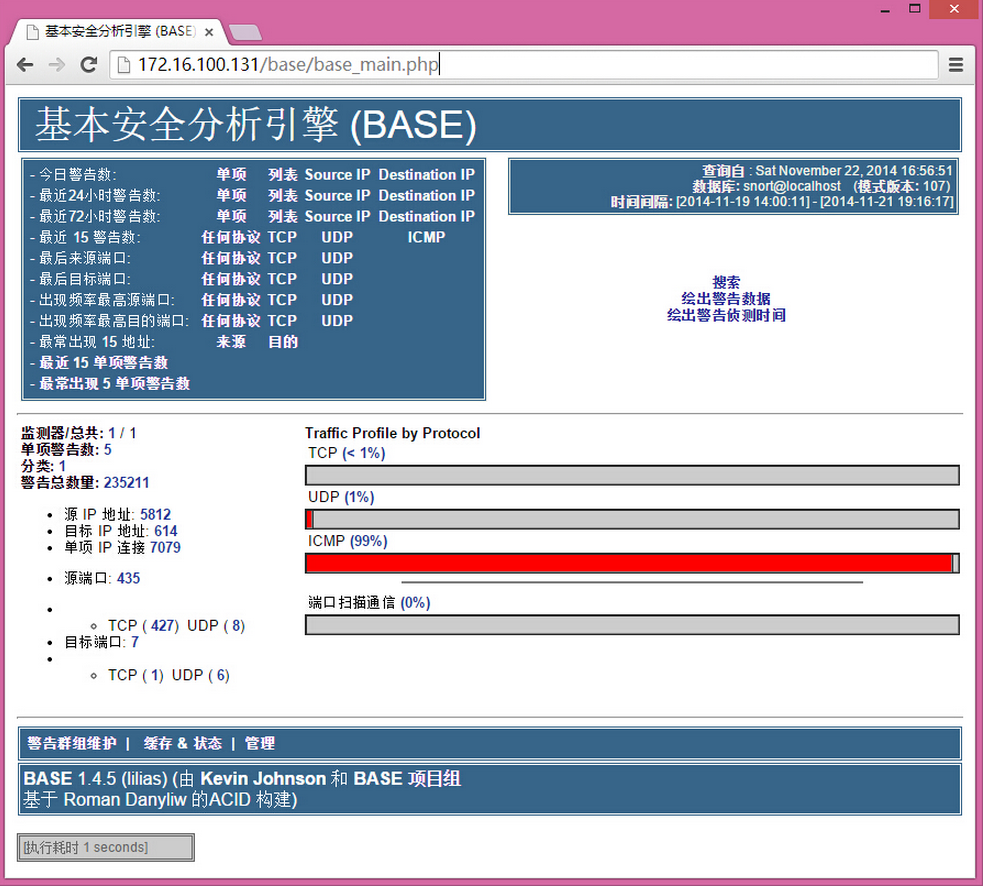

# snort入侵检测系统安装手册

linux 系统snort安装指南  

** [参考链接](http://blog.csdn.net/cnbird2008/article/details/8730017) **

## 准备工作
安装CentOS-6.6-x86_64-minimal.iso，给系统设置IP和dns让系统可以联网.

### 安装wget
```
 #yum install wget –y
```

### 更换源
更换成阿里云源，更新系统、下载软件速度快
```
 #mv /etc/yum.repos.d/CentOS-Base.repo /etc/yum.repos.d/CentOS-Base.repo.backup

 #wget -O /etc/yum.repos.d/CentOS-Base.repo http://mirrors.aliyun.com/repo/Centos-6.repo

 #yum clean all

 #yum makecache
```

### 更新系统
```
 #yum -y update
```

### 安装epel源
```
 #yum install -y epel-release
```

### 下载安装文件
把安装包里的安装文件下载到CentOS里备用，这里放到/root

## 安装配置LMAP

### 安装LMAP组件
```
 #yum install -y httpd mysql-server php php-mysql php-mbstring php-mcrypt mysql-devel php-gd
```

### 安装php插件
```
 #yum install -y mcrypt libmcrypt libmcrypt-devel
```

### 安装pear插件
```
 #yum install -y php-pear
 #pear upgrade pear
 #pear channel-update pear.php.net
 #pear install mail    
 #pear install Image_Graph-alpha Image_Canvas-alpha Image_Color Numbers_Roman
 #pear install  mail_mime
```

### 安装adodb
```
 #tar zxvf adodb519.tar.gz -C /var/www/html
 #mv /var/www/html/adodb5 /var/www/html/adodb
```

### 安装base
```
 #tar zxvf base-1.4.5.tar.gz -C /var/www/html
 #mv /var/www/html/base-1.4.5 /var/www/html/base
```

### 修改php.ini
```
 #vi /etc/php.ini
         error_reporting = E_ALL & ~E_NOTICE
```

### 设置html目录权限
```
 #chown -R apache:apache /var/www/html
```

### 设置adodb权限
```
 #chmod 755 /var/www/html/adodb
```

### 配置mysql
解压barnyard2（这里要用里面的文件创mysql表）
```
 #tar zxvf barnyard2-1.9.tar.gz
```
启动mysql
```
 #service mysqld start
```

设置root密码为123456
```
 #mysqladmin -u root -p password 123456
```

以root登陆mysql
```
 #mysql -u root -p
```

创建名为snort的数据库
```
 >create database snort;
```

创建名为snort、密码为123456的数据库用户并赋予名为snort数据库权限  
```
 >grant create,select,update,insert,delete on snort.* to snort@localhost identified by '123456';
```

退出
```
 >exit
```

创建数据库表  
```
 #mysql -u snort -p -Dsnort < /root/barnyard2-1.9/schemas/create_mysql
```

### 配置base
```
 #service mysqld start                启动mysql
 #service httpd start                            启动apache
 #service iptables stop               关闭防火墙
```
用浏览器打开http://172.16.100.131/base/setup/index.php（IP换成你自己的）

#### 点击Continuue


#### 选择显示语言，设置adodb路径


#### 配置数据库
   
在这一步可能会有报错，服务器连不上  
解决办法：  
create user 'root'@'192.168.0.235' identified by '你的密码';   
grant all privileges on *.* to root@'localhost';   

#### 设置admin用户和密码（这里应该是设置admin的用户和密码，我这里跟mysql的root一样）


#### 点击“Createe BASE AG”


#### 成功的话会有红色successfilly created字样，如下图（Centos7没有，原因未知），点击“step 5”


#### 安装成功


## 安装配置snort+barnyard2

### 安装依赖包
```
 #yum install gcc flex bison zlib libpcap tcpdump gcc-c++ pcre* zlib* libdnet libdnet-devel 
```

### 安装libdnet
（这里必须是这个版本）
```
 #tar zxvf libdnet-1.12.tgz
 #cd libdnet-1.12
 #./configure && make && make install  
```

### 安装libpcap
（这里必须）
```
 #wget http://www.tcpdump.org/release/libpcap-1.0.0.tar.gz
 #tar zxvf libpcap-1.0.0.tar.gz
 #cd libpcap-1.0.0
 #./configure && make && make install 
```

### 安装DAQ
```
 #tar zxvf daq-2.0.4.tar.gz
 #cd daq-2.0.4
 #./configure && make && make install  
```

### 安装snort
```
 #tar zxvf snort-2.9.7.0.tar.gz
 #cd snort-2.9.7.0
 #./configure && make && make install 
```

### 配置snort
创建需要的文件和目录
```
 #mkdir /etc/snort
 #mkdir /var/log/snort
 #mkdir /usr/local/lib/snort_dynamicrules
 #mkdir /etc/snort/rules
 #touch /etc/snort/rules/white_list.rules /etc/snort/rules/black_list.rules
 #cp /root/snort-2.9.7.0/etc/gen-msg.map threshold.conf classification.config reference.config unicode.map snort.conf /etc/snort/ 
```
编辑配置文件
```
#vi /etc/snort/snort.conf
```
定义路径变量
```
 var RULE_PATH /etc/snort/rules
 var SO_RULE_PATH /etc/snort/so_rules
 var PREPROC_RULE_PATH /etc/snort/preproc_rules
 var WHITE_LIST_PATH /etc/snort/rules
 var BLACK_LIST_PATH /etc/snort/rules
```
设置log目录
```
config logdir：/var/log/snort
```
配置输出插件
```
output unified2:filename snort.log,limit 128 
```

### 配置规则
```
 #tar zxvf snortrules-snapshot-2970.tar.gz -C /etc/snort/
 #cp /etc/snort/etc/sid-msg.map /etc/snort/ 
```

### 测试snort
```
 #snort -T -i eth0 -c /etc/snort/snort.conf
```
参数解释：
-T      指定启动模式：测试  
-i       指定网络接口  
-c      指定配置文件  
如果出现“success”的字样说明配置好了  
按ctrl+c终止测试  

### 安装barnyard2
```
 #cd /root/barnyard2-1.9
 #./configure --with-mysql --with-mysql-libraries=/usr/lib64/mysql/
 #make && make install
```

### 配置barnyard2
创建需要的文件和目录   
```
 #mkdir /var/log/barnyard2
 #touch /var/log/snort/barnyard2.waldo
 #cp /root/barnyard2-1.9/etc/barnyard2.conf /etc/snort
```
修改配置文件   
```
 #vi /etc/snort/barnyard2.conf  
 config logdir:/var/log/barnyard2
 config hostname:localhost
 config interface:eth0
 config waldo_file:/var/log/snort/barnyard.waldo
 output database: log, mysql, user=snort password=123456 dbname=snort host=localhost
```

### 测试barnyard2
```
 #barnyard2 -c /etc/snort/barnyard2.conf -d /var/log/snort -f snort.log -w /var/log/snort/barnyard2.waldo
```
参数解释：   
-c      指定配置文件   
-d      指定log目录  
-f       指定log文件  
-w     指定waldo文件  
  Ps：执行这一步可能会有报错  
    
解决办法：  
```
create user 'root'@'192.168.0.235' identified by '你的密码';
grant all privileges on *.* to root@'localhost';
```
如果出现“Waiting for new spool file”字样则表示barnyard2配置成功   
按ctrl+c终止测试   
## 测试IDS是否正常工作
### 添加测试规则
```
 #vi /etc/snort/rules/local.rules
```
添加一条检查ping包的规则
```
 alert icmp any any -> any any (msg: "IcmP Packet detected";sid:1000001;)
```  
规则注解：  
- alert　　　　　　触发规则后做出的动作  
- icmp　　　　　　协议类型  
- 第一个any　　　　源IP（网段），any表示任意  
- 第二个any　　　　源端口，any表示任意  
- ->　　　　　　　　表示方向  
- 第三个any　　　　目标IP（网段），any表示任意  
- 第四个any　　　　目标端口，any表示任意  
- Msg字符　　　　告警名称  
- Sid　　　　　　id号，个人编写的规则使用1,000,000以上

### 配置IDS启动脚本
配置启动脚本
```
 #cp idsctl /sbin
 #chmod 755 /sbin/idsctl
```  

### 启动IDS
```
 #service mysqld start                启动mysql
 #service httpd start                  启动apache
 #service iptables stop               关闭防火墙
```   
使用脚本启动ids
```
 #idsctl start
```  
手动运行ids（2条命令先后运行，脚本启动失效可选）
```
 #barnyard2 -c /etc/snort/barnyard2.conf -d /var/log/snort -f snort.log -w /var/log/snort/barnyard2.waldo -D
 #snort -c /etc/snort/snort.conf -i eth0 -D
```  
（-D选项用来让命令转入后台运行，其他选项意义上文已有解释）  

### 测试IDS
向IDS的IP发送ping包，base的页面会出现ICMP告警  
    
### 停止IDS
使用脚本停止IDS  
```
 #idsctl stop
```  
手动停止IDS  
```
 killall -9 snort barnyard2
```

## 安装snort可能碰到的报错及解决办法

### Error ： libpcap libpcap/headers (libpcap.a (or .so)/pcap.h)not found。
```
解决办法 ：yum install libpacp-devel
```

### Error ： Libpcre header not found.
```
解决办法 ： yum install pcre-devel
```

### Error ： dnet header not found
```
 解决办法 ： wget [url]http://prdownloads.sourceforge.net/libdnet/libdnet-1.11.tar.gz?download[/url]
 tar xvf libdnet-1.12.tgz
 cd libdnet-1.12
 ./configure && make && make install
```

### Error ： daq_static library not found
```
 解决办法 ：（1）下载 daq2.0 包 （2） tar zxvf daq2.0 (3) ./configure (4) make && make install
    daq运行./configure时报错：
 1. ERROR! Libpcap library version >= "1.0.0" not found.
 2.Get it from http://www.tcpdump.org"
 3.解决方法：从http://vscojot.free.fr/dist/snort/下载libpcap的rpm包，安装，问题解决
```

### Error ： C++ preprocessor "/lib/cpp" fails sanity
```
 check See `config.log' for more details
 解决办法 ： yum install glibc-headers ; yum install gcc-c++
```